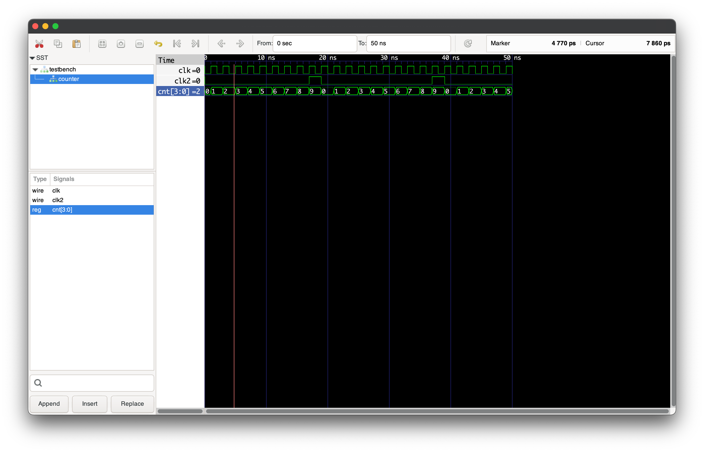

# Programms on SystemVerilog
***
## How to run:
```git clone https://github.com/kkozoriz/verilog_learn.git```

```cd verilog_learn/{package_name}```

```iverilog -o {output_file_name}.vvp {testbench_file_name}.v```

```/.../{output_file_name}.vvp``` 

```gtkwave```

New tab -> open .vcd file
***   
## Example for [counter](#counter)
```cd verilog_learn/counter```

```iverilog -o counter.vvp testbench.v```

```/{path_to_file}/counter.vvp```

## Counter 
